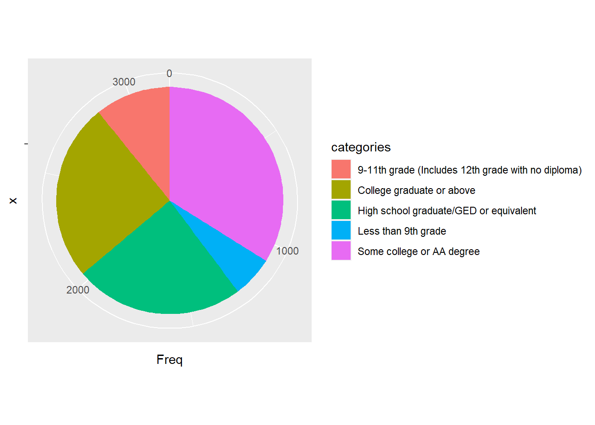
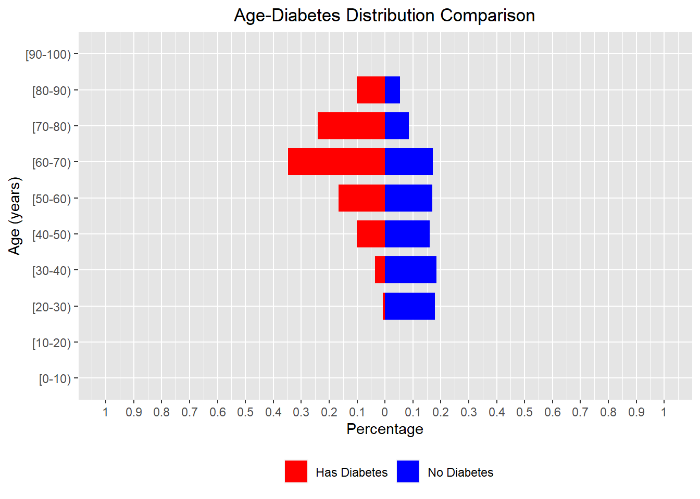
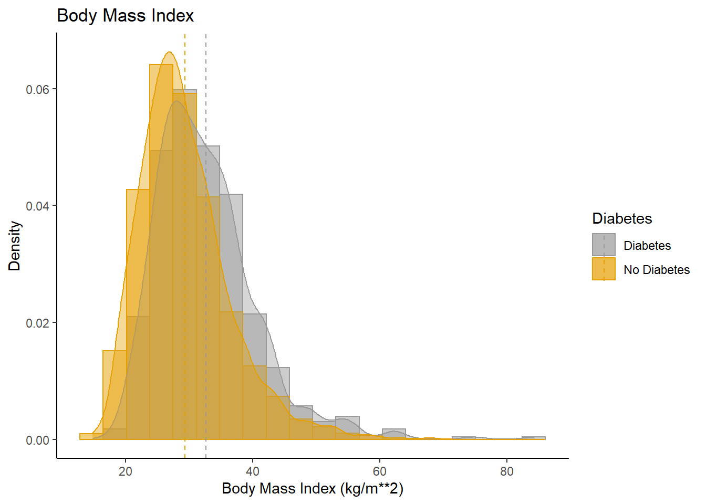
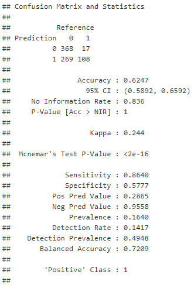
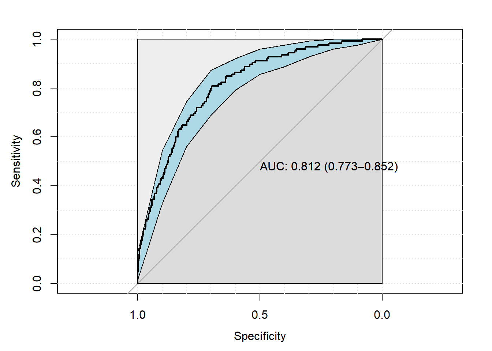

# BST260-FinalProject - Predicting Risk of Diabetes
### Author: Yuxin Xu, Runting Yang, Junyi Guo

## Overview and Motivation
Diabetes is a group of metabolic disorders characterized by a high blood sugar level over a prolonged period of time. In this project, we mainly focused on the analysis and prediction of the risks of diabetes. Our motivation for this project is: first, to find and analyze possible risk factors of diabetes, such as diet, smoking, health condition, and demographic and socioeconomic factors. Secondly, we would like to study the potential health-related influences of diabetes according to their lab test results and questionnaire answers. Finally, we would like to forecast whether an individual would develop Diabetes given the current living condition. 

We hope that these findings can lead to a better understanding of diabetes and help physicians and patients to prevent, treat, control, and manage diabetes.

Our entire project contains four major sections. We first preprcessed out data, then we conduct exploratory data analysis on the cleaned data, following that we build our data pipeline for preperation of the prediction process, and finally we constructed machine learning models to fulfill the prediction tasks.

## Data Overview
We used the dataset [`National Health and Nutrition Examination Survey`](https://www.cdc.gov/nchs/nhanes/about_nhanes.htm) collection by CDC from 2017 to 2018. It contains more than ten thousand interviewees' data that cover a variety of topics: demographics, examination, health status, diet, lab results, etcetera. We used a specific subset of the data that contains 8897 interviewees who participated in the diabetes survey. 

## Project Structure
### Data Preprocessing
In this section, we perform data cleaning on the raw data collected from CDC. Our dataset contains features from four categories: diet, demographics, examination and lab, and the raw data are stored in .XPT files.

There are a few steps that we performed across all categories of data:
1. Import data from .XPT file.
2. Select features we want and rename their columns from special indices into column names that's more intuitive.
3. Drop rows with NA values and extremely rare values.

### Exploratory Data Analysis adn Visualization
We perform some explorative analysis over the features we selected to examine if they seem to relate to our target variable (diabetes y/n). Since our dataset contains both categorical data and numerical data, we apply different kinds of visualization plot on our data. Here we list the type of graphs we used in this section:
* Pie chart: mainly for categorical data.

* Back-to-back histogram: mainly for numerical data.

* Histogram with density plot: mainly for numerical data.

### Data Pipeline
### Machine Learning Models
In order to train our model, we perform one-hot encoding, oversampling and use principle component analysis to help decrease the number of features.

We then train our model using five different algorithms: logistic regression, random forest, gradient boosting, support vector machine and k nearest neighbor. For each algorithm, we train with four different training datasets: a dataset without oversampling or PCA, a dataset with oversampling but without PCA, a dataset with PCA but without oversampling, and a dataset with both oversampling and PCA. 

#### Logistic Regression: the best one is balanced but without PCA

<table>
  <tr>
    <td>Confusion Matrix</td>
     <td>ROC Curve</td>
  </tr>
  <tr>
    <td></td>
    <td></td>
  </tr>
 </table>

## Conclusion
Based on the descriptive analysis and the predictive analysis we did previously, we were able to view and make prediction on whether a people with giving data is currently under high risks of developing diabetes. We conclude that diabetes patients above age 20 tend to be male, tends to be not as wealthy, tend to follow a healthier diet because of the disease, and tend to have higher BMI. The results of our project can be utilized to improve the health quality of the population. If the diabetes condition of a person id predicted to be positive, it does not indicate that the person is definitely developing diabetes. Since our models we optimized by the criteria of sensitivity, we are able to capture most of the of the people who is having diabetes, but our false positive rate is also relatively high.

Thus, people whoever get positive results from our model is suggested to conduct a diabetes test from medical center. Moreover, positive results also indicate that under current diet patterns and other conditions, one might be under a great risk of developing diabetes even this disease is not detected now.

## Links to Documents
[RMD file](https://github.com/yuxinxu77/BST260-FinalProject/blob/main/final_project.Rmd)

[HTML file](https://github.com/yuxinxu77/BST260-FinalProject/blob/main/final_project.html)
