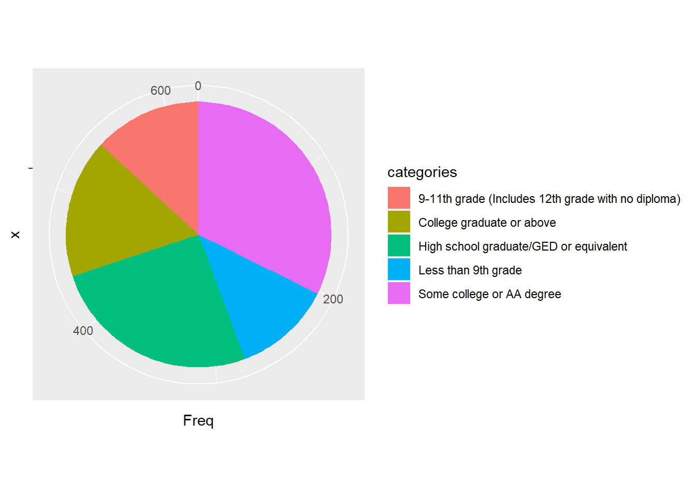

# BST260-FinalProject - Predicting Risk of Diabetes
### Author: Yuxin Xu, Runting Yang, Junyi Guo

## Overview and Motivation
Diabetes is a group of metabolic disorders characterized by a high blood sugar level over a prolonged period of time. In this project, we mainly focused on the analysis and prediction of the risks of diabetes. Our motivation for this project is: first, to find and analyze possible risk factors of diabetes, such as diet, smoking, health condition, and demographic and socioeconomic factors. Secondly, we would like to study the potential health-related influences of diabetes according to their lab test results and questionnaire answers. Finally, we would like to forecast whether an individual would develop Diabetes given the current living condition. 

We hope that these findings can lead to a better understanding of diabetes and help physicians and patients to prevent, treat, control, and manage diabetes.

Our entire project contains four major sections. We first preprcessed out data, then we conduct exploratory data analysis on the cleaned data, following that we build our data pipeline for preperation of the prediction process, and finally we constructed machine learning models to fulfill the prediction tasks.

## Data Overview
We used the dataset [`National Health and Nutrition Examination Survey`](https://www.cdc.gov/nchs/nhanes/about_nhanes.htm) collection by CDC from 2017 to 2018. It contains more than ten thousand interviewees' data that cover a variety of topics: demographics, examination, health status, diet, lab results, etcetera. We used a specific subset of the data that contains 8897 interviewees who participated in the diabetes survey. 

## Project Structure
### Data Preprocessing
In this section, we perform data cleaning on the raw data collected from CDC. Our dataset contains features from four categories: diet, demographics, examination and lab, and the raw data are stored in .XPT files.

There are a few steps that we performed across all categories of data:
1. Import data from .XPT file.
2. Select features we want and rename their columns from special indices into column names that's more intuitive.
3. Drop rows with NA values and extremely rare values.

### Exploratory Data Analysis and Visualization
We perform some explorative analysis over the features we selected to examine if they seem to relate to our target variable (diabetes y/n). Since our dataset contains both categorical data and numerical data, we apply different kinds of visualization plot on our data. Here we list the type of graphs we used in this section:
* Pie chart: mainly for categorical data.

* Back-to-back histogram: mainly for numerical data.

* Histogram with density plot: mainly for numerical data.

### Data Pipeline
### Machine Learning Models
In order to train our model, we perform one-hot encoding, oversampling and use principle component analysis to help decrease the number of features.

We then train our model using five different algorithms: logistic regression, random forest, gradient boosting, support vector machine and k nearest neighbor. For each algorithm, we train with four different training datasets: a dataset without oversampling or PCA, a dataset with oversampling but without PCA, a dataset with PCA but without oversampling, and a dataset with both oversampling and PCA. 

#### Logistic Regression: the best one is balanced but trained without PCA

<table>
  <tr>
    <td>Confusion Matrix</td>
     <td>ROC Curve</td>
  </tr>
  <tr>
    <td></td>
    <td></td>
  </tr>
 </table>

Logistic Regression is a linear classifier that can be used for prediction. We applied logistics regression on four training datasets with/without PCA and balanced/non-balanced.

Logistic regression achieved its best performance when we were using balanced data without PCA transformation. Imbalanced data caused the model to obtain very low sensitivity rate and the model fitted with imbalanced data can not correctly identify most of the diabetes patients. PCA transformation did not make significance differences in the model performances but model with PCA transformation tends to lower the specificity comparing with model without PCA transformation.

#### Random Forest: the best one is balanced but trained without PCA

<table>
  <tr>
    <td>Confusion Matrix</td>
     <td>ROC Curve</td>
  </tr>
  <tr>
    <td></td>
    <td></td>
  </tr>
 </table>
 
We trained Random Forest models on four training sets, with/without PCA and balanced/not balanced, respectively. After carefully tuning parameters and plotting ROC curves, we found that random forest models are very sensitive to imbalanced data. In our original training set, there are 1549 negative(0) observations, but only 500 positive(1) observations. Therefore, there is a significant probability that a bootstrap sample contains few or even none of the minority class, resulting in a tree with poor performance for predicting the minority class (https://statistics.berkeley.edu/tech-reports/666). Indeed, two of our models, trained by original imbalanced data, can hardly discriminate between 0 and 1. Instead, they classify almost everyone into the negative class.

Furthermore, in the two models trained by balanced data, we found that the model without PCA gives a better result, possibly because some information was lost in the process of performing PCA.

Finally, from all Random Forest models, we chose the model trained by balanced data without PCA. The area under the ROC curve (AUC) is 0.83, suggesting that it is a fairly good classification model. As high sensitivity is our first goal, we set a threshold such that sensitivity is high enough while specificity is acceptable.
 
 
 #### Boosting: the best one is not balanced and trained without PCA
 
 <table>
  <tr>
    <td>Confusion Matrix</td>
     <td>ROC Curve</td>
  </tr>
  <tr>
    <td></td>
    <td></td>
  </tr>
 </table>
 
Gradient boosting models tell a different story. Similarly, as training Random Forest model, we tried on four training datasets with/without PCA and balanced/non-balanced.

However, in this case, PCA had a strong negative impact on model performance. On the other hand, the boosting model is very robust to handle imbalanced data: both models training by balanced/imbalanced data give similar result, with AUC around 0.83. To keep the model training process simple, we chose the one trained by original imbalanced data.

 #### Support Vector Machine: the best one is balanced but trained without PCA
 
 <table>
  <tr>
    <td>Confusion Matrix</td>
     <td>ROC Curve</td>
  </tr>
  <tr>
    <td></td>
    <td></td>
  </tr>
 </table>
 
SVM stands for support vector machine. This binary classification algorithm aims to create a hyperplane in the hyperspace of data with features being the dimensions, that split the two classes to different sides as much as possible. In our training, we used linear kernal, did 10-fold cross validation, and trained using dataset with principal component analysis and oversampling, dataset without principal component analysis and with oversampling, dataset with principal component analysis and without oversampling, and dataset without principal component analysis or oversampling. We also normalized each feature before training so that they all have zero mean and unit variance.

Turns out that the best model trained using SVM algorithm is the one trained with dataset oversampled and without principal component analysis.

It’s not hard to see why SVM performs better in a balanced dataset using oversampling. Since SVM uses penalty to update the hyperplane at each round, if the data is significantly imbalanced, SVM is going to penalize more by the dominant class and affected less by the class with fewer data. In our case, we care more about the class with less instances (the positive class). As a result, it’s easy to see that a balanced dataset will produce a better performance.

We suspect the reason that SVM performs better with principal component analysis is that PCA filtered out some spatial information in the 28 features we picked that could be important to the training of SVM.
 
 #### K Nearest Neighbor: the best one is balanced and trained with PCA
 
 <table>
  <tr>
    <td>Confusion Matrix</td>
     <td>ROC Curve</td>
  </tr>
  <tr>
    <td></td>
    <td></td>
  </tr>
 </table>

KNN stands for k-nearest neighbor. It assumes that similar objects belongs to the the same class. For each data point in the test set, it finds the nearest k neighbors with classes, look at their classes and assign the class with most vote to the data point. For KNN, we set k to 18, and trained using dataset with principal component analysis and oversampling, dataset without principal component analysis and with oversampling, dataset with principal component analysis and without oversampling, and dataset without principal component analysis or oversampling.

For KNN, the best model is the one trained with dataset oversampled and with principal component analysis.

It’s also not a surprise that KNN performs better in a balanced dataset. KNN is, in its essence, a communty-level voting system that considers a majority of vote as a win. So no wonder the dominant class will use its dominance in number to affect the voting result, even when in some cases, data points have some neighbors from the non-dominant class and actually belong to that class themselves. A balanced dataset can avoid much of this negative effect.

KNN requires a dense distribution of data points in the hyperspace of data, and is thus very vulnerable to the curse of dimensionality. With principal component analysis decreasing th dimensions, for KNN, it is imaginable that this help outweighs the loss of information caused by principal component analysis.

## Conclusion
Based on the descriptive analysis and the predictive analysis we did previously, we were able to view and make prediction on whether a people with giving data is currently under high risks of developing diabetes. We conclude that diabetes patients above age 20 tend to be male, tends to be not as wealthy, tend to follow a healthier diet because of the disease, and tend to have higher BMI. The results of our project can be utilized to improve the health quality of the population. If the diabetes condition of a person id predicted to be positive, it does not indicate that the person is definitely developing diabetes. Since our models we optimized by the criteria of sensitivity, we are able to capture most of the of the people who is having diabetes, but our false positive rate is also relatively high.

Thus, people whoever get positive results from our model is suggested to conduct a diabetes test from medical center. Moreover, positive results also indicate that under current diet patterns and other conditions, one might be under a great risk of developing diabetes even this disease is not detected now.

## Links to Documents
[RMD file](https://github.com/yuxinxu77/BST260-FinalProject/blob/main/final_project.Rmd)

[HTML file](https://github.com/yuxinxu77/BST260-FinalProject/blob/main/final_project.html)
